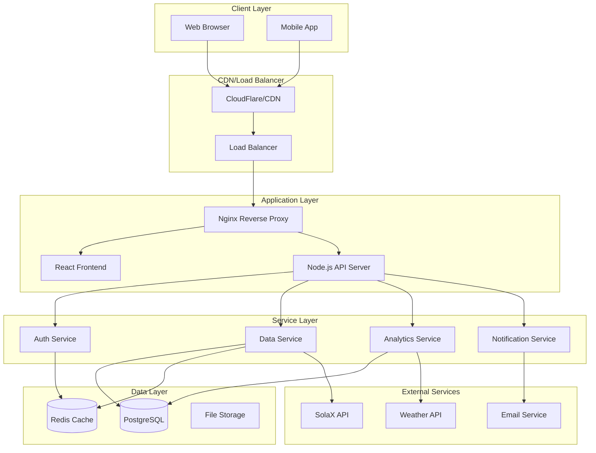
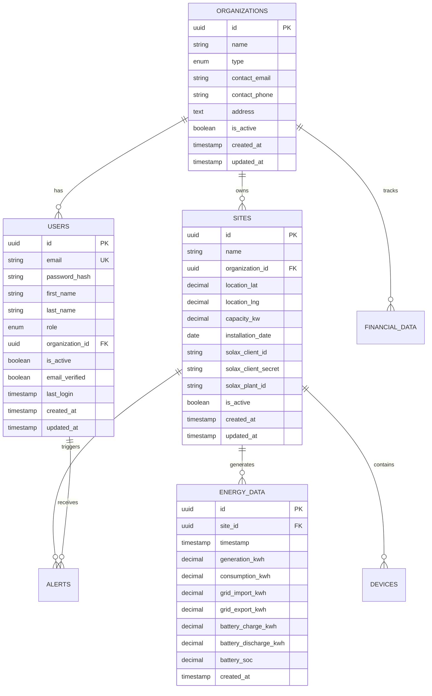
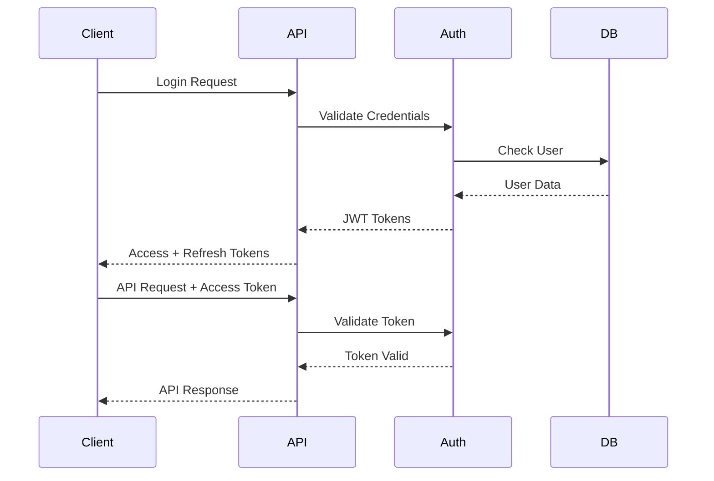

# SolarNexus - System Design Document

## Table of Contents
1. [System Overview](#system-overview)
2. [Architecture Design](#architecture-design)
3. [Component Design](#component-design)
4. [Database Design](#database-design)
5. [API Design](#api-design)
6. [Security Design](#security-design)
7. [Performance Design](#performance-design)
8. [Scalability Design](#scalability-design)
9. [Integration Design](#integration-design)
10. [Deployment Design](#deployment-design)

## System Overview

### Purpose
SolarNexus is designed as a comprehensive solar energy management platform that provides real-time monitoring, predictive analytics, and financial optimization for solar installations across multiple stakeholders.

### Design Principles
1. **Scalability**: Horizontal scaling capability for growing user base
2. **Security**: Multi-layered security with role-based access control
3. **Performance**: Sub-second response times for critical operations
4. **Reliability**: 99.9% uptime with automated failover
5. **Maintainability**: Modular architecture with clear separation of concerns
6. **Extensibility**: Plugin architecture for future integrations

### System Boundaries
```
┌─────────────────────────────────────────────────────────────┐
│                    SolarNexus Platform                     │
├─────────────────────────────────────────────────────────────┤
│  Frontend (React)  │  Backend (Node.js)  │  Database (PG)  │
├─────────────────────────────────────────────────────────────┤
│              External Integrations                          │
│  • SolaX Cloud API    • Weather APIs    • Email Service    │
└─────────────────────────────────────────────────────────────┘
```

## Architecture Design

### High-Level Architecture



### Microservices Architecture

#### Core Services
1. **Authentication Service**
   - User authentication and authorization
   - JWT token management
   - Role-based access control

2. **Data Management Service**
   - Solar data ingestion and processing
   - Real-time data streaming
   - Data validation and cleansing

3. **Analytics Service**
   - Performance calculations
   - Predictive analytics
   - Report generation

4. **Notification Service**
   - Alert management
   - Email notifications
   - Real-time updates

#### Service Communication
```typescript
interface ServiceCommunication {
  protocol: 'HTTP' | 'WebSocket' | 'Message Queue';
  authentication: 'JWT' | 'Service Token';
  dataFormat: 'JSON' | 'Protocol Buffers';
  errorHandling: 'Circuit Breaker' | 'Retry Logic';
}
```

## Component Design

### Frontend Components

#### Component Hierarchy
```
App
├── AuthProvider
├── Router
│   ├── PublicRoutes
│   │   ├── LoginPage
│   │   └── RegisterPage
│   └── PrivateRoutes
│       ├── DashboardPage
│       ├── SitesPage
│       ├── AnalyticsPage
│       └── SettingsPage
├── Layout
│   ├── Header
│   ├── Sidebar
│   └── Footer
└── Providers
    ├── ThemeProvider
    ├── NotificationProvider
    └── DataProvider
```

#### Key Components Design

##### Dashboard Component
```typescript
interface DashboardProps {
  organizationId: string;
  timeRange: TimeRange;
}

interface DashboardState {
  sites: Site[];
  energyData: EnergyData[];
  alerts: Alert[];
  loading: boolean;
  error: string | null;
}

class Dashboard extends React.Component<DashboardProps, DashboardState> {
  // Real-time data updates via WebSocket
  // Performance metrics calculation
  // Alert management
}
```

##### Site Management Component
```typescript
interface SiteManagerProps {
  organizationId: string;
  permissions: Permission[];
}

const SiteManager: React.FC<SiteManagerProps> = ({
  organizationId,
  permissions
}) => {
  // Site CRUD operations
  // Bulk operations support
  // Export functionality
};
```

### Backend Components

#### Service Layer Design
```typescript
abstract class BaseService {
  protected logger: Logger;
  protected database: Database;
  protected cache: Cache;
  
  abstract validate(data: any): ValidationResult;
  abstract process(data: any): Promise<any>;
  abstract handleError(error: Error): void;
}

class SiteService extends BaseService {
  async createSite(siteData: CreateSiteRequest): Promise<Site> {
    // Validation
    const validation = this.validate(siteData);
    if (!validation.isValid) {
      throw new ValidationError(validation.errors);
    }
    
    // Business logic
    const site = await this.database.sites.create(siteData);
    
    // Cache update
    await this.cache.invalidate(`sites:${siteData.organizationId}`);
    
    return site;
  }
}
```

#### Controller Layer Design
```typescript
class SiteController {
  constructor(
    private siteService: SiteService,
    private authService: AuthService
  ) {}
  
  @Route('POST', '/sites')
  @Authenticate()
  @Authorize(['admin', 'manager'])
  @ValidateBody(CreateSiteSchema)
  async createSite(req: Request, res: Response): Promise<void> {
    try {
      const site = await this.siteService.createSite(req.body);
      res.status(201).json({ success: true, data: site });
    } catch (error) {
      this.handleError(error, res);
    }
  }
}
```

## Database Design

### Entity Relationship Diagram


### Database Optimization

#### Indexing Strategy
```sql
-- Performance indexes
CREATE INDEX idx_energy_data_site_timestamp ON energy_data(site_id, timestamp DESC);
CREATE INDEX idx_alerts_site_status ON alerts(site_id, status) WHERE status != 'closed';
CREATE INDEX idx_users_organization_active ON users(organization_id) WHERE is_active = true;

-- Composite indexes for common queries
CREATE INDEX idx_sites_org_active ON sites(organization_id, is_active);
CREATE INDEX idx_energy_data_hourly ON energy_data(site_id, date_trunc('hour', timestamp));
```

#### Partitioning Strategy
```sql
-- Partition energy_data by month for better performance
CREATE TABLE energy_data_y2024m01 PARTITION OF energy_data
    FOR VALUES FROM ('2024-01-01') TO ('2024-02-01');

CREATE TABLE energy_data_y2024m02 PARTITION OF energy_data
    FOR VALUES FROM ('2024-02-01') TO ('2024-03-01');
```

#### Data Retention Policy
```sql
-- Automated data cleanup
CREATE OR REPLACE FUNCTION cleanup_old_energy_data()
RETURNS void AS $$
BEGIN
    DELETE FROM energy_data 
    WHERE timestamp < NOW() - INTERVAL '2 years';
END;
$$ LANGUAGE plpgsql;

-- Schedule cleanup job
SELECT cron.schedule('cleanup-energy-data', '0 2 * * 0', 'SELECT cleanup_old_energy_data();');
```

## API Design

### RESTful API Design Principles

#### Resource Naming
```
GET    /api/v1/organizations          # List organizations
POST   /api/v1/organizations          # Create organization
GET    /api/v1/organizations/{id}     # Get organization
PUT    /api/v1/organizations/{id}     # Update organization
DELETE /api/v1/organizations/{id}     # Delete organization

GET    /api/v1/sites                  # List sites
POST   /api/v1/sites                  # Create site
GET    /api/v1/sites/{id}             # Get site
PUT    /api/v1/sites/{id}             # Update site
DELETE /api/v1/sites/{id}             # Delete site

GET    /api/v1/sites/{id}/energy      # Get energy data
POST   /api/v1/sites/{id}/energy      # Add energy data
```

#### Response Format
```typescript
interface ApiResponse<T> {
  success: boolean;
  data?: T;
  error?: {
    code: string;
    message: string;
    details?: any;
  };
  meta?: {
    pagination?: {
      page: number;
      limit: number;
      total: number;
      totalPages: number;
    };
    timestamp: string;
    version: string;
  };
}
```

#### Error Handling
```typescript
enum ErrorCodes {
  VALIDATION_ERROR = 'VALIDATION_ERROR',
  AUTHENTICATION_ERROR = 'AUTHENTICATION_ERROR',
  AUTHORIZATION_ERROR = 'AUTHORIZATION_ERROR',
  NOT_FOUND = 'NOT_FOUND',
  INTERNAL_ERROR = 'INTERNAL_ERROR',
  RATE_LIMIT_EXCEEDED = 'RATE_LIMIT_EXCEEDED'
}

class ApiError extends Error {
  constructor(
    public code: ErrorCodes,
    public message: string,
    public statusCode: number,
    public details?: any
  ) {
    super(message);
  }
}
```

### GraphQL API Design (Future)
```graphql
type Query {
  organizations(filter: OrganizationFilter): [Organization!]!
  sites(filter: SiteFilter): [Site!]!
  energyData(siteId: ID!, timeRange: TimeRange!): [EnergyData!]!
}

type Mutation {
  createSite(input: CreateSiteInput!): Site!
  updateSite(id: ID!, input: UpdateSiteInput!): Site!
  deleteSite(id: ID!): Boolean!
}

type Subscription {
  energyDataUpdated(siteId: ID!): EnergyData!
  alertCreated(organizationId: ID!): Alert!
}
```

## Security Design

### Authentication Architecture


### Authorization Model
```typescript
interface Permission {
  resource: string;
  action: 'create' | 'read' | 'update' | 'delete';
  conditions?: {
    organizationId?: string;
    siteId?: string;
    userId?: string;
  };
}

interface Role {
  name: string;
  permissions: Permission[];
}

const roles: Record<string, Role> = {
  admin: {
    name: 'admin',
    permissions: [
      { resource: '*', action: 'create' },
      { resource: '*', action: 'read' },
      { resource: '*', action: 'update' },
      { resource: '*', action: 'delete' }
    ]
  },
  manager: {
    name: 'manager',
    permissions: [
      { resource: 'sites', action: 'create', conditions: { organizationId: 'user.organizationId' } },
      { resource: 'sites', action: 'read', conditions: { organizationId: 'user.organizationId' } },
      { resource: 'sites', action: 'update', conditions: { organizationId: 'user.organizationId' } }
    ]
  }
};
```

### Data Encryption
```typescript
interface EncryptionConfig {
  algorithm: 'AES-256-GCM';
  keyDerivation: 'PBKDF2';
  saltLength: 32;
  iterations: 100000;
  tagLength: 16;
}

class EncryptionService {
  async encrypt(data: string, key: string): Promise<EncryptedData> {
    // Implementation
  }
  
  async decrypt(encryptedData: EncryptedData, key: string): Promise<string> {
    // Implementation
  }
}
```

## Performance Design

### Caching Strategy
```typescript
interface CacheStrategy {
  levels: {
    browser: {
      staticAssets: '1 year';
      apiResponses: '5 minutes';
    };
    cdn: {
      staticAssets: '1 year';
      apiResponses: '1 minute';
    };
    application: {
      userSessions: '24 hours';
      frequentQueries: '15 minutes';
      analytics: '1 hour';
    };
    database: {
      queryResults: '5 minutes';
      aggregations: '30 minutes';
    };
  };
}
```

### Database Performance
```typescript
interface DatabaseOptimization {
  connectionPooling: {
    min: 5;
    max: 20;
    idleTimeoutMillis: 30000;
  };
  queryOptimization: {
    enableQueryPlan: true;
    slowQueryThreshold: 1000; // ms
    indexHints: true;
  };
  readReplicas: {
    enabled: true;
    count: 2;
    loadBalancing: 'round-robin';
  };
}
```

### Frontend Performance
```typescript
interface FrontendOptimization {
  bundleOptimization: {
    codesplitting: true;
    lazyLoading: true;
    treeShaking: true;
    compression: 'gzip';
  };
  rendering: {
    virtualScrolling: true;
    memoization: true;
    debouncing: 300; // ms
  };
  assetOptimization: {
    imageOptimization: true;
    fontSubsetting: true;
    criticalCss: true;
  };
}
```

## Scalability Design

### Horizontal Scaling
```yaml
# Kubernetes deployment example
apiVersion: apps/v1
kind: Deployment
metadata:
  name: solarnexus-api
spec:
  replicas: 3
  selector:
    matchLabels:
      app: solarnexus-api
  template:
    spec:
      containers:
      - name: api
        image: solarnexus/api:latest
        resources:
          requests:
            memory: "256Mi"
            cpu: "250m"
          limits:
            memory: "512Mi"
            cpu: "500m"
        env:
        - name: DATABASE_URL
          valueFrom:
            secretKeyRef:
              name: db-secret
              key: url
```

### Auto-scaling Configuration
```typescript
interface AutoScalingConfig {
  metrics: {
    cpu: {
      targetUtilization: 70;
      scaleUpThreshold: 80;
      scaleDownThreshold: 30;
    };
    memory: {
      targetUtilization: 80;
      scaleUpThreshold: 90;
      scaleDownThreshold: 40;
    };
    requestRate: {
      targetRPS: 100;
      scaleUpThreshold: 150;
      scaleDownThreshold: 50;
    };
  };
  scaling: {
    minReplicas: 2;
    maxReplicas: 10;
    scaleUpCooldown: 300; // seconds
    scaleDownCooldown: 600; // seconds
  };
}
```

## Integration Design

### External API Integration
```typescript
interface ExternalApiConfig {
  solax: {
    baseUrl: 'https://www.solaxcloud.com:9443/proxy/api';
    authentication: 'token';
    rateLimiting: {
      requestsPerMinute: 60;
      burstLimit: 10;
    };
    retryPolicy: {
      maxRetries: 3;
      backoffStrategy: 'exponential';
      initialDelay: 1000;
    };
    circuitBreaker: {
      failureThreshold: 5;
      recoveryTimeout: 30000;
    };
  };
}
```

### Message Queue Design
```typescript
interface MessageQueueConfig {
  provider: 'Redis' | 'RabbitMQ' | 'AWS SQS';
  queues: {
    dataIngestion: {
      name: 'solar-data-ingestion';
      concurrency: 5;
      retryAttempts: 3;
      deadLetterQueue: 'solar-data-dlq';
    };
    notifications: {
      name: 'notifications';
      concurrency: 10;
      retryAttempts: 2;
      deadLetterQueue: 'notifications-dlq';
    };
    analytics: {
      name: 'analytics-processing';
      concurrency: 3;
      retryAttempts: 1;
      deadLetterQueue: 'analytics-dlq';
    };
  };
}
```

## Deployment Design

### Container Architecture
```dockerfile
# Multi-stage build for optimization
FROM node:20-alpine AS builder
WORKDIR /app
COPY package*.json ./
RUN npm ci --only=production

FROM node:20-alpine AS runtime
WORKDIR /app
COPY --from=builder /app/node_modules ./node_modules
COPY dist ./dist
EXPOSE 3000
CMD ["node", "dist/server.js"]
```

### Infrastructure as Code
```yaml
# docker-compose.yml
version: '3.8'
services:
  api:
    build: .
    ports:
      - "3000:3000"
    environment:
      - NODE_ENV=production
    depends_on:
      - postgres
      - redis
    healthcheck:
      test: ["CMD", "curl", "-f", "http://localhost:3000/health"]
      interval: 30s
      timeout: 10s
      retries: 3
    deploy:
      replicas: 3
      resources:
        limits:
          memory: 512M
        reservations:
          memory: 256M
```

### Monitoring and Observability
```typescript
interface MonitoringConfig {
  metrics: {
    prometheus: {
      enabled: true;
      endpoint: '/metrics';
      collectDefaultMetrics: true;
    };
    customMetrics: [
      'api_request_duration',
      'database_query_duration',
      'external_api_calls',
      'active_users',
      'energy_data_points_processed'
    ];
  };
  logging: {
    level: 'info';
    format: 'json';
    destinations: ['console', 'file', 'elasticsearch'];
  };
  tracing: {
    jaeger: {
      enabled: true;
      endpoint: 'http://jaeger:14268/api/traces';
    };
  };
  alerting: {
    rules: [
      {
        name: 'high_error_rate';
        condition: 'error_rate > 0.05';
        duration: '5m';
        severity: 'critical';
      },
      {
        name: 'high_response_time';
        condition: 'response_time_p95 > 2s';
        duration: '10m';
        severity: 'warning';
      }
    ];
  };
}
```

---

*This system design document serves as the architectural blueprint for SolarNexus and should be updated as the system evolves.*